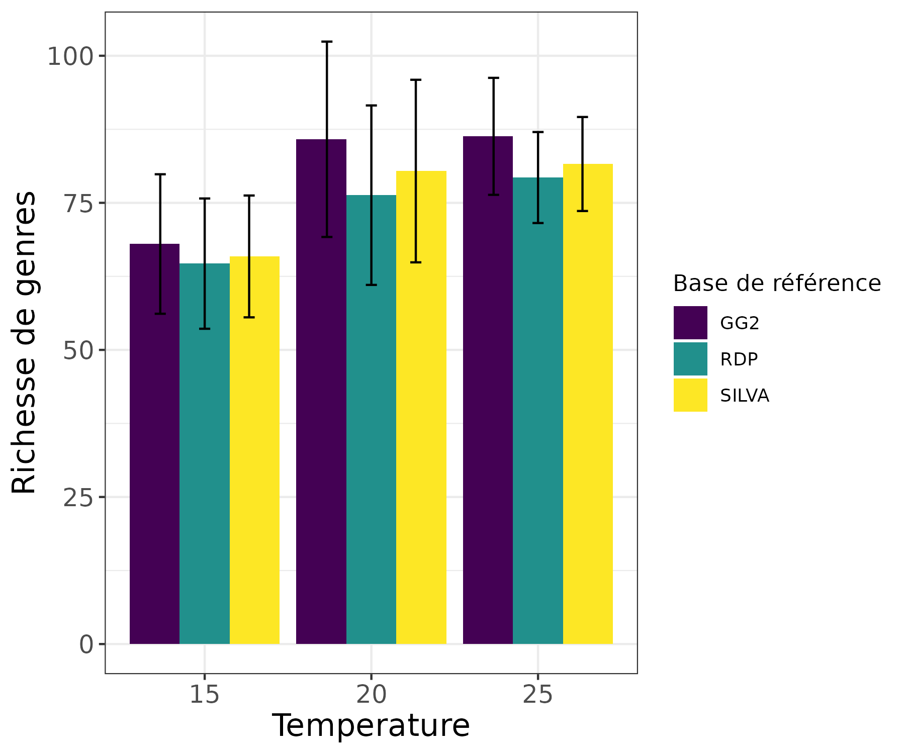

# Le microbiome du complexe de nématodes Litoditis marina face aux changements environnementaux

## I - Introduction

### Contexte et modèle d'étude

Litoditis marina est un nématode méiobenthique, largement distribué dans les environnements estuariens caractérisés par un fort hydrodynamisme. Commun à travers le monde, cet organisme bactériophage se distingue par une grande variabilité dans ses comportements reproducteurs et sa tolérance aux stress physiologiques. Des études ont également révélé la co-occurrence d'espèces cryptiques au sein de L. marina, suggérant des interactions complexes régies par le principe d’exclusion de Gause. Ces interactions peuvent toutefois évoluer vers une coexistence si un partitionnement efficace des niches écologiques s’établit. Les changements environnementaux, quant à eux, jouent un rôle clé dans la dynamique des communautés, favorisant parfois les compétiteurs moins dominants et modifiant les capacités compétitives des espèces en présence. Enfin, le rôle du microbiome associé à ces organismes dans leur réponse aux perturbations environnementales reste une question cruciale et encore peu explorée.

### Méthodologie

#### Expérience
Afin de déterminer le rôle du microbiome dans la réponse aux changements envionnementaux, une étude à été menée afin d'evaluer l'effet des changements de temperature sur la composition du microbiome de quatres espèces de _L. marina_. 30 individus de chacune de ces espèces ont été étudiés avec 10 individus placés dans différentes conditions de températures : 15°C, 20°C, et 25 °C. Pour chacune des conditions de tempéréture, deux conditions de régime alimentaire étaient présentes : avec (_E.coli_) et sans nourriture.

#### Acquisition des données génétiques 
Du métabarcodage ADN a été réalisé afin d'identifier en simultanée la composition taxonomique du microbiome des individus. Un échantillon du microbiome de chaque individu a été prélevé et l'ADN extrait. Puis, la portion de gène codant pour la région V4 de la petite sous-unité de l'ARNr 16S a été amplifiée par PCR et séquencée via la technologie Illumina (Illumina MiSeq, 2 x 300 pb). Cette portion de séquence est variable, mais connue pour être conservée au cours de l'évolution, faisant d'elle un candidat très répandu pour identifier et différencier des échantillons génétiquement. Une table avec le nom des variants de séquence d'amplicon (ASV) et leur nombre est obtenu pour chaque individu, ainsi qu'un fichier fasta faisant la correspondance entre la séquence et le nom d'ASV attribué. Dans le cadre du projet, les fichiers fournis contiennent des ASVs qui ont été filtrés et nettoyés au préalable. 

#### Assignation taxonomique

L'assignation taxonomique est réalisée sur R grâce à la fonction assignTaxonomy du package DADA2 en fournissant les séquences des ASVs, prélablement transformés en vecteurs de chaine de caractère, ainsi qu'une fichier fasta d'entrainement comprenant la taxonomie correspondant à chaque séquence. 

Pour plus de détails, voir : [Preparation data.ipynb](2.Preparation data.ipynb)

### Les bases de référence taxonomiques

Trois bases de référence sont utilisées pour l'assignation et comparées : GreenGenes, SILVA et Ribosomal Database Project (RDP).

- **SILVA** contient des informations taxonomiques sur les bactéries, les eucaryotes et les archées. Elle repose principalement sur la phylogénie des petites sous-unités d'ARNr (16S pour les procaryotes et 18S pour les eucaryotes) et permet une classification détaillée jusqu'au niveau de l'espèce.

- **GreenGenes** est dédiée aux bactéries et aux archées, avec une classification basée sur la construction automatique d'arbres phylogénétiques de novo, en s'appuyant sur des références existantes (principalement NCBI). Ces arbres sont générés à partir de séquences 16S ARNr issues de bases publiques après vérification de leur qualité.

- **RDP** regroupe des séquences 16S ARNr de bactéries, d'archées et de champignons. Contrairement à SILVA, cette base propose une classification taxonomique qui s’arrête au niveau du genre.

### Objectif du projet 
L'objectif de ce projet est de déterminer si la composition du microbiome varie avec la température et de déterminer si ce résultat change en fonction de la base de référence utilisée pour l'assignation taxonomique. Les analyses 
Cette étude permettra d’évaluer les performances de ces trois bases permettant d'identifier objectivement celle qui serait pertinente à utiliser pour le traitement des résultats de cette recherche.

Pour ce faire, différentes analyses préliminaires, détaillées ci-après, ont été réalisées. Dans le cadre de ce projet, les analyses ont été réalisées pour une seule espèce (PM4) élévée dans les 3 conditions de température et avec nourriture. La condition "avec nourriture" a été choisie pour ne pas avoir d'effet confondant due à un stress nutritif. L'espèce PM4 a été choisie car elle possédait le plus grand nombre de réplicats par condition de température (entre 9-10).

## II  - Analyses 

Les analyses sont réalisées a partir d'un jeu de donné issu de la fusion entre la table de contingence des ASVs, les métadonnées de l'expérience et les assignations taxonomiques. Pour plus de détails, voir [Preparation data.ipynb](2.Preparation data.ipynb)

### 1) Différences de fréquence d'assignation selon la base de référence d'assignation taxonomique

Dans cette partie, nous avons déterminé  le fréquence à laquelle chaque base de référence à fait une assignation taxonomique jusqu'au rang du genre et de l'espèce. 

Concernant la fréquence d'assignation au genre : 
- Elle semble légèrement plus élevée pour GG2 que SILVA et RDP pour toutes les températures ; cet écart semble plus marqué pour 20°C et 25°C.
- Elle semble être sensiblement la même pour toutes les températures avec une très faible diminution qui semble se dessiner. 

Concernant la fréquence d'assignation à l'espèce : 
- Elle est plus faible qu'au genre pour toutes les bases de données
- La base de référence SILVA présente environ 2 fois moins d'assignations que RDP et GG2
- RDP est la base qui assigne plus fréquemment jusqu'à l'espèce
- A part pour GG2, le nombre d'assignations au genre semble diminuer avec une élévation de température

Pour plus de détails, voir : [3.Frequence assignation.ipynb](3.Frequence assignation.ipynb)

Après avoir déterminé la fréquence d'assignation, nous avons analysé à quel point les bases de références étaient concordantes pour les assignations faites. 

### 2) Concordance des assignations

#### 2.1 Assignation de l'espece la plus abondante et du genre le plus abondant

Pour assurer la fiabilité des analyses, nous avons d'abord vérifié l'abondance de E. coli, car les nématodes ont été nourris avec cette bactérie. Sa présence en trop grande quantité pourrait introduire un biais. Cette vérification nous a permis d'estimer le nombre de E. coli afin de les exclure si nécessaire. Pour plus d'informations, voir la partie I du script : [4.Dominance.ipynb](4.Dominance.ipynb)

Par la suite, nous avons analysé les données pour identifier l’espèce et le genre le plus abondant en fonction des différentes températures et des bases de données utilisées. Les résultats ont montré que l’espèce la plus fréquente n’était pas E. coli, écartant ainsi ce potentiel biais.

En approfondissant l’analyse, nous avons constaté que l’espèce la plus abondante était identique pour toutes les températures, mais variait selon la base de données : GG2 identifie cette espèce comme rumoiensis, SILVA comme casei, tandis que RDP ne propose aucune attribution spécifique à l’ASV la plus fréquente.
Quant au genre, il reste constant quel que soit la base de données ou la température, confirmant une cohérence dans ce niveau de classification. Ici, le genre dominant est Vibrio. Pour plus d'information, voir la partie II du script : [4.Dominance.ipynb](4.Dominance.ipynb)

Nous avons donc choisi par la suite de nous concentrer sur les genres etant donnée les reusltats trouvés precedemment et nous avons essayé de voir si il y avait une concordance de l'ensemble des assignations de genre à l'aide d'un diagramme de Venn. 

#### 2.2 Concordance de l'ensemble des assignations de genre : Diagramme de Venn 

Evaluation de la consistence des assignations faites au niveau du genre selon les différentes bases de données pour chacune des températures.
Les genres attribué a chaque ASV par chacune des bases de données sont comparé pour mesurer les accords et désaccord des attributions taxonomiques. Le résultat de ces comparaisons est représenté sous la forme d'un diagramme de Venn pour chacune des températures. Cette analyse repose sur le fait que les attrbutions taxonomiques utilise la même typologie entre les bases de données. La bases de référence GreeGenes pouvant présenter une typologie différente (ajout d'un suffixe à la fin du genre) cette différence peut amplifier la différence d'assignation de cette base taxonomique aux deux autres.

[5.Concordance assignation.ipynb](5.Concordance assignation.ipynb)

### 3) Alpha diversité : Richesse de genres

Dans cette partie, nous déterminons la richesse de genres assignés. Il s'agit de déterminer le **nombre total de genres distincts qui ont été assignés**. 

Sur le graphique, nous observons que : 
- La richesse de genre moyenne semble augmenter pour une élévation de température entre 15°C et 20°C; elle semble rester constante de 20°C à 25°C pour GG2 et légèrement augmenter pour SILVA et RDP. 
- Pour une même température, en prenant en compte la variabilité avec l'erreur standard, la richesse de genres ne présente pas de différences significatives entre bases de références.

Il semblerait donc qu'il y ait une plus grande diversité du microbiome à des températures plus élevées. Cependant, cette analyse ne prend en compte que les ASVs qui ont obtenus une assignation taxonomique. Ce résultat peut donc être biasé par le fait que les bases de références contiendraient plus de références taxonomiques pour des procaryotes ayant des optimums et des seuils de tolérance de température plus élevées. 

Contrairement à la fréquence d'assignation, la richesse en genres semble augmenter avec la température. En terme de proportion, cela voudrait dire que pour un plus faible nombre d'assignations totales à 25°C, les assignations étaient moins redondantes qu'à 15°C. 

Une  PERMANOVA _Richesse de genre ~ Température * Base de référence_ utilisant la matrice de dissimilarité de Bray-Curtis a révélé que : 
- la base de référence (F = 0.19, R² = 0.004, p = 0.912) n'a pas d'effet significatif. L'absence d'influence de la base de donnée sur la richesse de genre était attendu car d'un point de vue écologique la base de référence utilisée ne devrait pas avoir une influence sur la diversité. 
- l'interaction entre la température et base de référence (F = 0.02, R² = 0.001, p = 1.00) n'est pas significative. L'absence d'effet de l'intéraction entre température et base de donnée montre que pour une même température peu importe la base de référence utilisée, il n'y aura pas de différence de diversité. 
- il existe des **différences significatives dans la richesse de genre en fonction de la température** (F = 2.94, R² = 0.069, p = 0.046).  Un test post-hoc a révélé que les différence de richesse est significative entre les températures 15°C et 15°C (p = 0.007) et elle est bien due a une différence de composition et non de dispersion (p = 0.976). 
 
Ces trois points sont réconfortants d'un point de vue méthodologique : il y a un effet de la température sur la diverité de genre et celui-ci peu être démontré peu importe la base de référence utilisée pour l'assignation taxonomique. Il est à noter que le modèle complet explique uniquement 8% de la variation totale (R² = 0.08). Ainsi, d'autres facteurs seraient à prendre en compte pour expliquer la diversité. 

Pour plus de détails, voir : [6.Alpha diversite.ipynb](6.Alpha diversite.ipynb)

## Conclusion et perspectives

### Conclusion

Le choix de la base de référence dépend de la question de recherche et la précision taxonomique souhaitée. Lorsqu'on s'intéresse principalement au genre, par rapport aux résultats des analyse préliminaires réalisées les trois bases de données semblent équivalentes d'un point de vue quantitatif (_cf. II-1_). D'un point de vue qualitatif (_cf. II-2_) SILVA et RDP présentent une assez forte similitude d’assignation; et GreeGenes permet l’assignation d’ASV plutôt bien représentés dans nos échantillons qui ne seraient pas assignés par les 2 autres bases de références (_cf. II-2.2_)

Lorsqu'on s'intéresse à une assignation plus fine jusqu'à l'espèce  : 
- GreeGenes se démarque des 2 autres bases de référence en offrant un nombre d’assignations jusqu’au niveau de l’espèce relativement élevé, tout en permettant d’attribuer une espèce à l’ASV la plus abondante. 
- RDP présente le plus grand nombre d’assignations jusqu'à l’espèce, mais ne parvient pas à identifier une espèce pour l’ASV dominante.
- SILVA, bien qu’elle affiche le plus faible nombre d’assignations jusqu’à l’espèce,a l’avantage d’attribuer une espèce à l’ASV la plus fréquente.
Ainsi, le compromis entre la qualité et la quantité des assignations semble faire de Greengenes le meilleur choix. 

Cependant, il est important de noter que GG2 se démarque en partie à cause d’une différence de typologie dans le genre assigné qui inclut des suffixes après le nom des genres. Cela pourrait engendrer une surestimation de la diversité, en répertoriant plusieurs variations pour un même genre. Cette particularité pourrait être un biais dans l’interprétation des résultats, notamment en amplifiant artificiellement la diversité des genres identifiés. Mesurer la qualité des assignations offertes par ces bases requiererait une approche phylogénétique plus fine. 

### Perspectives
En termes de perspectives, il serait pertinent d'examiner de plus près les indices de diversité tels que Shannon, Piélou et Simpson qui prennent en compte l'équitabilité, ainsi que la bêta-diversité, afin d'évaluer l'impact de ce stress sur les communautés. Ces analyses pourraient également être étendues à d'autres échantillons, incluant différentes espèces cryptiques, pour vérifier si les résultats obtenus sont cohérents ou s'il existe des réponses différentes en fonction de l'espèce qui pourraient expliquer leur coexistance. Par ailleurs, il serait intéressant de reprendre l'analyse en utilisant le régime alimentaire en facteur explicatif, en intéraction ou non avec la température. Il pourait être pertinant de reproduire l'expérience en introduisant d'autres facteurs de stress environnementaux, comme l'hydrodynamisme ou la salinité. 

## FAIRNESS ?
La fairness de nos analyses peut être évaluée selon plusieurs critères.

### Données 

Concernant les données, les données génétiques utilisent un format formel et partagé par la communauté scientifique. Les les metadonnées sont décrites, riches et bien organisées. Toutes les donénes utilisent des formats reconnus et utilisables par divers langages de programmation. Ceci rend les données interopérables. Cependant, les données analysées ont été analysées dans le cadre de ce module pédagogique n'ont pas encore été rendues publiques. Ceci limite leur accessibilité et par conséquent leur trouvabilité et leur réutilisation. 

### Analyses
Nos analyses sont accesibles car publiées sur une plateforme en ligne dans un répertoire publique et nos scripts sont écrits en langage R, dont l'environnement R est logiciel gratuit et libre d'accès. En termes d'interopérabilité, nos analyses sont adaptées aux jeux de données similaires, mais pourraient être améliorées. En effet, la création de fonctions génériques permettrait d'adapter automatiquement les scripts à des jeux de données variés, indépendamment des noms de variables, augmenterait ainsi leur flexibilité et leur réutilisation à grande échelle.